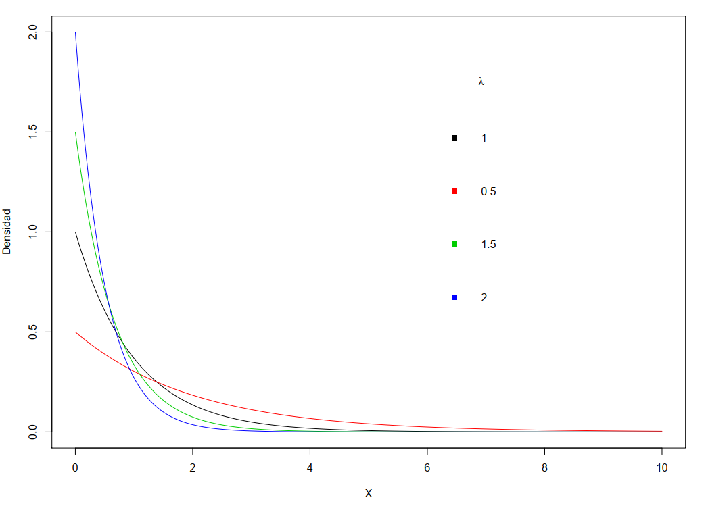
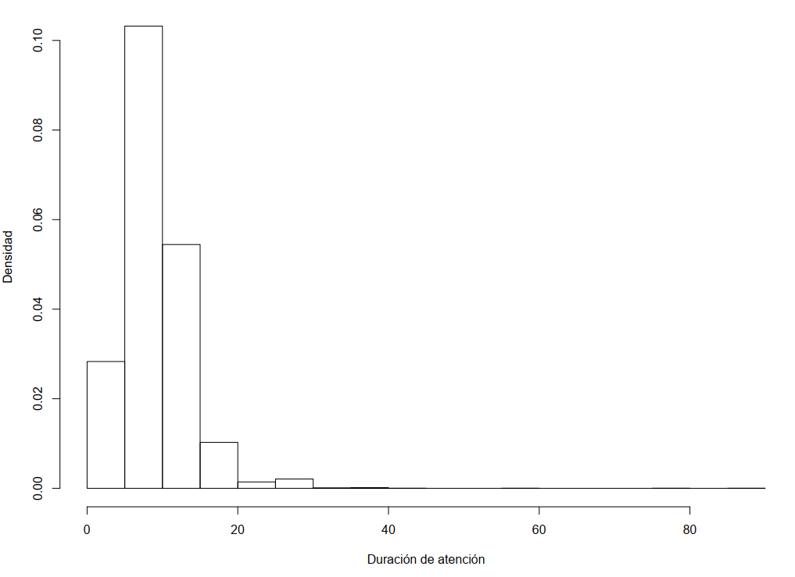
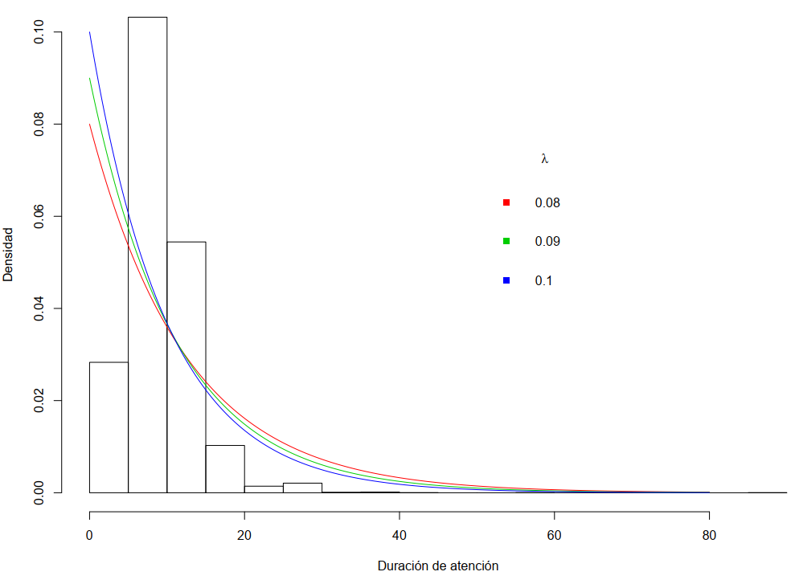
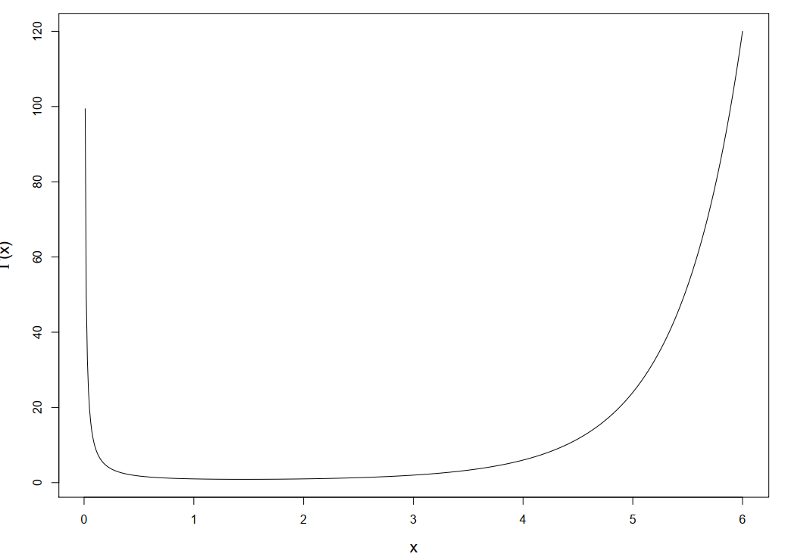
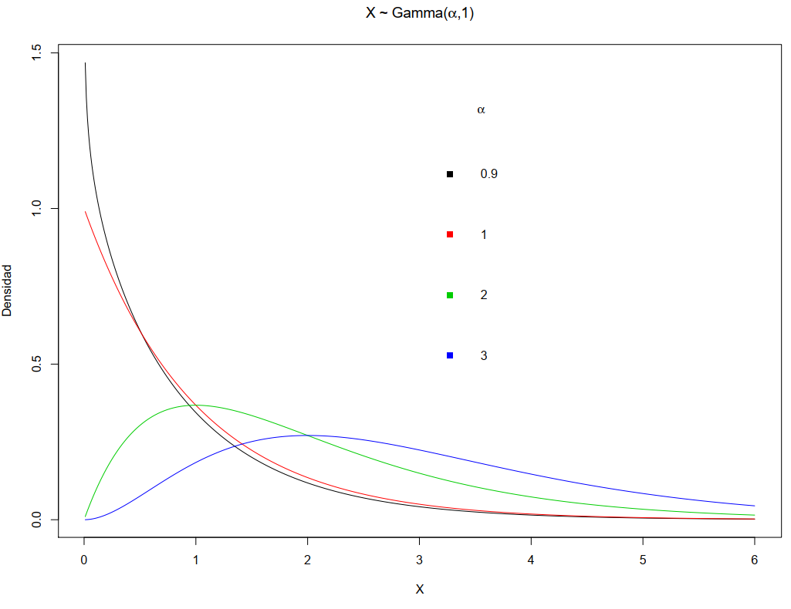
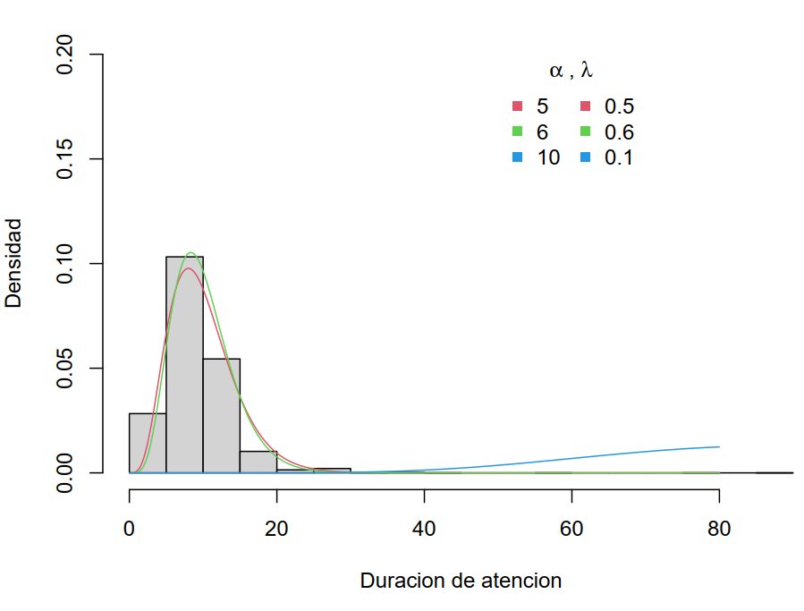
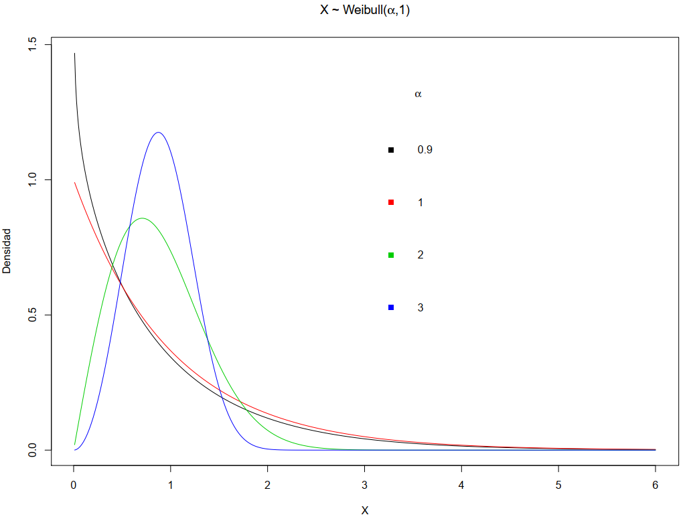
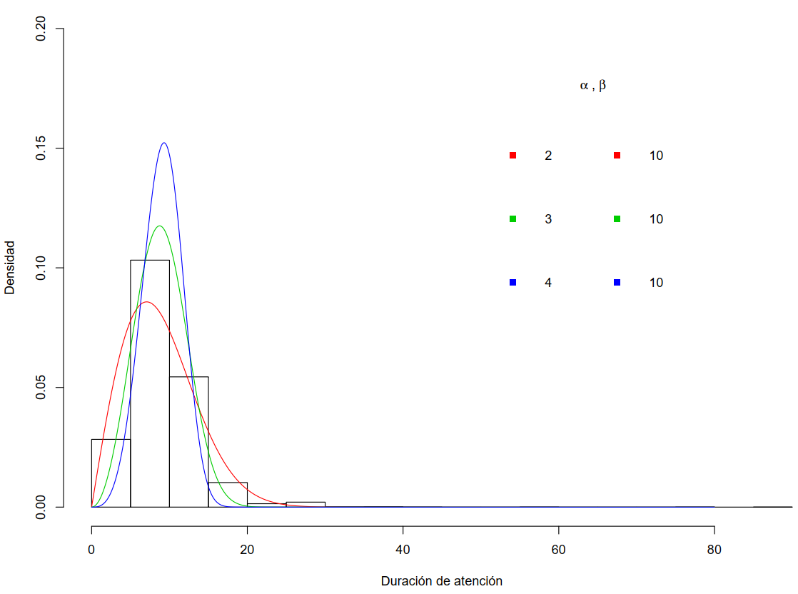

# Modelos Notables para v.a. continuas

## Modelo: Exponencial


### Función de densidad f
-   Sea $X$ una variable aleatoria (v.a.) continua

-   Decimos que $X$ sigue un modelo exponencial y se denota por
    $$X \sim Exponencial(\lambda) \ , \ \lambda >0$$ si su función de
    densidad es $$f(x) = 
    \left \{
    \begin{array}{ccc}
    \lambda e^{- \lambda x} & , & x>0 \\
    0 & , & x \leq 0
    \end{array}
    \right.$$ donde $\lambda>0$ se le llama el parámetro de escala.

### Función acumulada F

-   La función de distribución acumulada es $$F(x) = 
    \left \{
    \begin{array}{ccc}
    1 - e^{- \lambda x} & , & x>0 \\
    0 & , & x \leq 0
    \end{array}
    \right.$$

### Gráficamente

{width=500px}

### Esperanza y varianza.

-   La esperanza y varianza son

  $$\begin{aligned}
  E[X] &=& \frac{1}{\lambda} 
  \nonumber \\
  Var[X] &=& \frac{1}{\lambda^2}
  \nonumber\end{aligned}$$

-   La mediana es $$Q_2 = -\frac{1}{\lambda} \log_e{(0.5)}$$

-   El percentil 100p% para $p \in (0,1)$ es
    $$q_p = -\frac{1}{\lambda} \log_e{(1-p)}$$


### Nota: Otros parametros.

-   Otra parametrización es en función de su valor esperado
    $$X \sim Exponencial(\beta) \ , \ \beta >0$$

-   La función de densidad y de distribución acumulada son

  $$\begin{aligned}
  f(x) &=& \frac{1}{\beta} e^{-x/\beta} \ , \ x > 0 
  \nonumber \\
  F(x) &=& e^{-x/\beta} \ , \ x > 0 
  \nonumber\end{aligned}$$

  y $0$ en caso contrario.

-   La esperanza y la varianza son

  $$\begin{aligned}
  E[X] &=& \beta 
  \nonumber \\
  Var[X] &=& \beta^2
  \nonumber \end{aligned}$$

### Ejercicios:

#### Cálculos en R

 Supongamos que $X \sim Exponencial(\lambda=2)$: 

* Calcular $P(X\leq 1)$

```{r}
pexp(1,rate=2)
```

* Calcular  $P(X > 4) =  1- P(X \leq 4)$

```{r}
1 - pexp(4,rate=2)
```      

* $P(1 \leq X \leq 10) = F(10) - F(1)$

```{r}
pexp(10,rate=2) -  pexp(1,rate=2)
```

* El percentil 90. Es decir $P(X \leq q_{0.9}) = 0.9$

```{r}
qexp(0.9,rate=2)
```

#### Caso: Tiempo de atención

-   Consideremos la Encuesta de satisfacción en salud (del año 2015).
-   En esta encuesta se obtuvo la duración de la atención de pacientes.
-   En R, podemos obtener los datos y ver sus medidas de resumen:


```{r warning=FALSE}
library(haven)
enlace="http://portal.susalud.gob.pe/wp-content/uploads/archivo/base-de-datos/2015/CUESTIONARIO%2001%20-%20CAPITULOS.sav"
salud.paciente <- read_sav(enlace)

# Datos de pacientes: 
attr(salud.paciente$C1P14,"label")
summary(salud.paciente$C1P14)

# Varianza y desviación estandard
mean(salud.paciente$C1P14,na.rm = T)
var(salud.paciente$C1P14,na.rm = T)
sd(salud.paciente$C1P14,na.rm = T)

```

-   La media y desviación éstandar de la duración de la atención son 11.13
    y 4.7 minutos, respectivamente.


{width=500px}


-   Sea $X$ la duración de la atención en minutos

-   Supongamos que $X$ se modela via $$X \sim Exponencial(\lambda)$$

-   Comparación:


  * A partir de los datos:

$\bar{X}$ |$S_X^2$ |$Q_2$
---------|---------|---------
11.13    |21.9     |10


  * A partir de modelos exponenciales:

$\lambda$ |$E[X]$ |$Var[X]$ |$Q_2$
---------|---------|---------|---------
0.08 | 12.5 | 156.25 | 8.66
0.09 | 11.1 | 123.46 | 7.70
0.1 | 10 | 100 | 6.93

-   Note que todos los modelos (usados) esperan **más variabilidad** que la observada.


{width=400x}


## Modelo: Gamma


### Función de densidad f

-   Decimos que una variable continua $X$ es Gamma y se denota por
    $$X \sim Gamma(\alpha,\lambda) \ , \  \alpha > 0 \ , \ \lambda >0$$

-   Su función de densidad es 

$$
f(x) = 
\left \{
\begin{array}{ccc}
\frac{\lambda^\alpha}{\Gamma(\alpha)} x^{\alpha - 1}e^{- \lambda x} & , & x>0 \\
0 & , & x \leq 0
\end{array}
\right.
$$

donde

* $(\alpha,\lambda)$: Son los parametros de forma y escala,
        respectivamente.

* $\Gamma(\cdot)$: Es la función Gamma


-   La función gamma esta definida por $$\Gamma(x)
    =
    \int_0^{\infty} u^{x-1} e^{-u} du$$

-   Si $x \in Z^{+}$ $$\Gamma(x) = (x-1)!$$

<!---->

### Graficamente

{width=500x}{width=500px}

### Esperanza y varianza

-   La esperanza y varianza son

  $$\begin{aligned}
  E[X] &=& \frac{\alpha}{\lambda}
  \nonumber \\
  Var[X] &=& \frac{\alpha}{\lambda^2}
  \nonumber \end{aligned}$$

-   Si $X_1,\dots,X_n$ son independientes y
    $$X_i \sim Exponencial(\lambda)
    \ , \ i=1,\dots,n$$ entonces
    $$Y = X_1 + \dots + X_n \sim Gamma(n,\lambda)$$


### Ejercicios

#### Cálculos en R

Supongamos que $X \sim Gamma(\alpha=2,\lambda=2)$

* Cálculo de $P(X\leq 1)$

```{r}
pgamma(1,2,2)
```

* Cálculo de $P(X > 4) =  1- P(X \leq 4)$

```{r}
1 - pgamma(4,2,2)
```

* Cálculo de $P(1 \leq X \leq 10) = F(10) - F(1)$

```{r}
pgamma(10,2,2) - pgamma(1,2,2)
```

* El tercer cuartil $Q_3$

```{r}
qgamma(0.75,2,2)
```

#### Caso: Duración de la atención

-   Sea $X$ la duración de la atención en minutos

-   Supongamos que $X$ se modela via $$X \sim Gamma(\alpha,\lambda)$$

-   Comparación


  * A partir de los datos:

$\bar{X}$ |$S_X^2$ |$Q_2$
---------|---------|---------
11.13    |21.9     |10


  * A partir de modelos gamma:

$\alpha$ | $\lambda$ |$E[X]$ |$Var[X]$ |$Q_2$
---------|---------|---------|---------
5 | 0.5 | 10 | 20 | 9.34
6 | 0.6 | 10 | 16.67 | 9.45
10 | 0.1 | 10 | 1000 | 96.69
 
 
Graficando los datos y los modelos candidatos:


{width=500px}


## Modelo: Weibull


### Función de densidad f
-   Decimos que una variable continua $X$ es Gamma y se denota por
    $$X \sim Weibull(\alpha,\beta) \ , \  \alpha > 0 \ , \ \beta >0$$

-   Su función de densidad es $$f(x) =
    \left \{
    \begin{array}{ccc} 
    \frac{\alpha}{\beta} 
    \left ( \frac{x}{\beta} \right )^{\alpha-1}
    e^{- 
    \left( \frac{x}{\beta} \right)^{\alpha}} 
    & , & x > 0 \\
    0 & , & x \leq 0
    \end{array}
    \right.$$ donde $(\alpha,\beta)$ son los parametros de forma y
    escala, respectivamente.

### Función acumulada F

-   La función de distribución acumulada es $$F(x) =
    \left \{
    \begin{array}{ccc} 
    1 - 
    e^{- 
    \left( \frac{x}{\beta} \right)^{\alpha}} 
    & , & x > 0 \\
    0 & , & x \leq 0
    \end{array}
    \right.$$

-   La esperanza y varianza son

    $$\begin{aligned}
    E[X]   &=& \beta
    \Gamma \left ( 
    1+ \frac{1}{\alpha}
    \right )
    \nonumber \\
    Var[X] &=& \beta^2
    \left [
    \Gamma \left ( 
    1+ \frac{2}{\alpha}
    \right )
    -
    \left ( \Gamma \left ( 
    1+ \frac{1}{\alpha}
    \right ) \right )^2
    \right ]
    \nonumber \end{aligned}$$





### Ejercicios

### Cálculos en R

-   Supongamos que $X \sim Weibull(\alpha=2,\beta=2)$

* $P(X\leq 1)$

```{r}
pweibull(1,2,2)
# 0.2211992
```

* $P(X > 4) =  1- P(X \leq 4)$

```{r}
1 - pweibull(4,2,2)
```

* $P(1 \leq X \leq 10) = F(10) - F(2)$

```{r}
pweibull(10,2,2) - pweibull(1,2,2)
```

* El primer quartil $Q_1$

```{r}
qweibull(0.25,2,2)
```

 
#### Caso: Duración de atención

-   Sea $X$ la duración de la atención en minutos

-   Supongamos que $X$ se modela via $$X \sim Weibull(\alpha,\beta)$$

-   Comparación


  * A partir de los datos:

$\bar{X}$ |$S_X^2$ |$Q_2$
---------|---------|---------
11.13    |21.9     |10


  * A partir de modelos weibull con diferentes $\alpha$ y $\beta$:

$\alpha$ | $\beta$ |$E[X]$ |$Var[X]$ |$Q_2$
---------|---------|---------|---------
2| 10 | 8.86 | 21.46 | 8.33
3| 10 | 8.92 | 10.53 | 8.85
4| 10 | 9.06 | 6.47 | 9.12

 
#### Duración de atención

* En R, se puede obtener la mediana, media y varianza para el modelo.

* Medianas:

```{r}
qweibull(0.5,2,10)
```

```{r}
qweibull(0.5,3,10)
```

```{r}
qweibull(0.5,4,10)
```


* Cálculo de la media:

```{r}
fun210 = function(x) x*dweibull(x,2,10)
fun310 = function(x) x*dweibull(x,3,10)
fun410 = function(x) x*dweibull(x,4,10)

funx2_210 = function(x) x^2*dweibull(x,2,10)
funx2_310 = function(x) x^2*dweibull(x,3,10)
funx2_410 = function(x) x^2*dweibull(x,4,10)

E210   = integrate(fun210,0,Inf)
E210

E310   = integrate(fun310,0,Inf)
E310

E410   = integrate(fun410,0,Inf)
E410
```

* También, es posible calcular la varianza:

```{r}
Var210 = integrate(funx2_210,0,Inf)$value - E210$value^2
Var210
```


#### Graficando {-}

{width=500px}